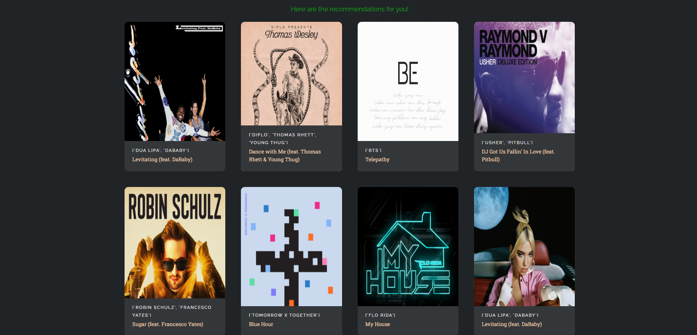
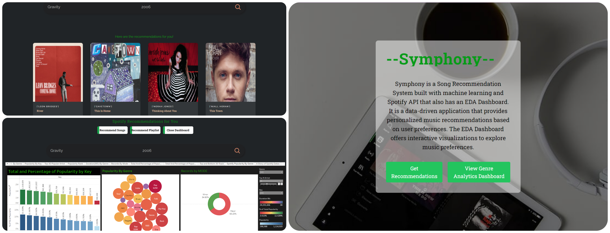

# Symphony - Spotify Recommendation System

Symphony is a Spotify recommendation system that suggests playlists and songs based on your interests. It is an end-to-end full-stack project that includes an Exploratory Data Analysis (EDA) web app, Spotify API integration, front-end built with React.js and Tailwind CSS, back-end developed with Flask, and model deployment.

## Demo

Check out the live demo: http://symmphonyai.s3-website.ap-south-1.amazonaws.com/




## Features

- Recommends playlists and songs based on user interests.
- Exploratory Data Analysis (EDA) dashboard to explore insights from the data.
- Seamless integration with the Spotify API to fetch song and playlist information.
- Front-end built with React.js and styled using Tailwind CSS for a modern and responsive UI.
- Back-end developed with Flask to handle user requests and interact with the Spotify API.
- Continuous Integration and Continuous Deployment (CI/CD) pipeline setup with Amazon Web Services (AWS) using GitHub Actions and Docker for automated testing and deployment.





## Technology Stack

- Front-End: React.js, Tailwind CSS
- Back-End: Flask
- Database: (mention the database you used, if applicable)
- API: Spotify API
- Deployment: Amazon Web Services (AWS), Docker

## Getting Started

To run the project locally, follow these steps:

1. Clone the repository: `git clone https://github.com/your-username/symphony.git`
2. Navigate to the project folder: `cd symphony`
3. Install front-end dependencies: `cd frontend && npm install`
4. Install back-end dependencies: `cd backend && pip install -r requirements.txt`
5. Set up environment variables:
   - Create a `.env` file in the `backend` folder.
   - Add your Spotify API credentials to the `.env` file:

     ```
     SPOTIFY_CLIENT_ID=your_spotify_client_id
     SPOTIFY_CLIENT_SECRET=your_spotify_client_secret
     ```

6. Start the back-end server: `cd backend && python app.py`
7. Start the front-end development server: `cd frontend && npm start`
8. Open your browser and go to: `http://localhost:3000`

## Folder Structure

